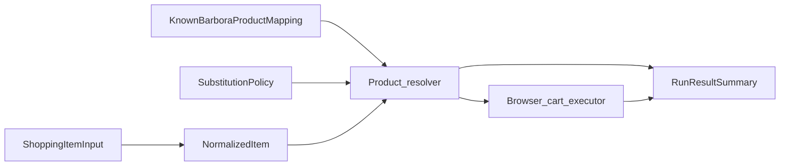

# Data model (MVP)

## Purpose and scope

This document defines **conceptual data shapes** for barbora-cart-agent: what information moves between the [input layer, resolver, memory, executor, and summary boundary](system-design.md) for a single Barbora-focused MVP. It is **not** a persistence spec (no tables, files, or ORMs), **not** a matching or ranking strategy (see the planned [Latvian product matching](latvian-product-matching.md) spec), and **not** a presentation or export format for reports (see the planned [run summary](run-summary.md) spec).

**Payment:** The model supports automation **up to checkout handoff** only. It does **not** include payment methods, payment steps, or order completion. That matches [product requirements](product-requirements.md) and [user flow](user-flow.md).

**Barbora-only:** All catalog references are **Barbora.lv** products. There is no generic multi-retailer catalog layer.

## How the entities fit together

The resolver consumes **normalized items**, optional **known Barbora mappings**, and **substitution policy**. It emits decisions and instructions for the executor (shapes can stay implicit until implementation; this spec focuses on the five named entities below).

---

## 1. Shopping item input

**Purpose:** One line (or row) of **raw user shopping intent** before normalization. Text may be **Latvian**, mixed, or informal.

**Produced by:** User or upstream list source.  
**Consumed by:** Input normalization layer.

**Example fields (conceptual):**

| Field | Description |
|--------|-------------|
| `lineId` | Optional stable id within the submitted list (for tracing through a run). |
| `rawText` | Free-text line as the user wrote it (e.g. `piens 2l`, `maize`). |
| `quantityHint` | Optional unstructured hint if the user separated it (e.g. `2`); may be absent if everything is in `rawText`. |
| `notes` | Optional user notes (allergies, brand preference) at MVP discretion. |

**Example:**

- `rawText`: `"pilngraudu maize"`  
- `quantityHint`: `1`

---

## 2. Normalized item

**Purpose:** A **lean, practical** per-run record after the input layer: clean text, optional parsed quantity, and a stable **line identity** for the rest of the pipeline. This is **not** a product ontology: no global categories, taxonomies, or canonical grocery schema.

**Produced by:** Input normalization layer.  
**Consumed by:** Product resolver, summary (by reference).

**Example fields (conceptual):**

| Field | Description |
|--------|-------------|
| `lineId` | Ties back to the original input line when present; otherwise generated for the run. |
| `searchText` | Primary string used for Barbora search / matching (often Latvian; preserves meaningful wording). |
| `quantity` | Optional positive number when safely parsed; if unknown, resolver may treat as default `1` per project rules. |
| `unit` | Optional free text only when clearly present (e.g. `l`, `g`, `iepak.`); avoid inventing a full unit system for MVP. |

**Example:**

- `lineId`: `"3"`  
- `searchText`: `"pilngraudu maize"`  
- `quantity`: `1`  
- `unit`: omitted

**Explicit non-goals:** Hierarchical product types, nutrition, shelf categories, or cross-store SKUs.

---

## 3. Known Barbora product mapping

**Purpose:** Remember that a given intent (or alias set) should resolve to a **specific Barbora product**, so the resolver can skip or narrow search. **Barbora-specific:** the target is always a Barbora catalog identity, not a generic “retailer product.”

**Produced by:** User confirmation, successful past runs, or manual curation (implementation later).  
**Consumed by:** Preference / memory store → resolver.

**Persistence:** How mappings are stored and loaded is **out of scope** for this document (covered by implementation work such as TASK-011 in the project backlog).

**Example fields (conceptual):**

| Field | Description |
|--------|-------------|
| `mappingId` | Optional id for updating or removing the mapping. |
| `matchKeys` | One or more strings that should match user or normalized text (e.g. normalized `searchText`, or shorter keys). |
| `aliases` | **First-class** list of extra Latvian (or mixed) variants: abbreviations, inflections, casual names (`piens` vs `pienu 2l`). |
| `barboraProductRef` | Opaque Barbora-side identifier as implementation discovers it (e.g. product id, stable path segment, or URL — **spec does not mandate** which Barbora exposes). |
| `displayName` | Optional human-readable Barbora title for summaries (often Latvian). |
| `lastConfirmedAt` | Optional; supports “prefer recent” behavior without defining storage. |

**Example:**

- `matchKeys`: `["piens 2l"]`  
- `aliases`: `["piens 2 litri", "Tere piens 2l"]`  
- `barboraProductRef`: `"<opaque Barbora id>"`  
- `displayName`: `"Tere piens 2,5%, 2 l"`

---

## 4. Substitution policy

**Purpose:** **Structured preferences** controlling whether a line may accept a substitute when the preferred Barbora product is missing or unsuitable. This is **policy data only**; it does not describe algorithms or ranking.

**Produced by:** Defaults + per-run or per-line user options (as the product allows).  
**Consumed by:** Product resolver.

**Example fields (conceptual):**

| Field | Description |
|--------|-------------|
| `defaultAllowSubstitute` | Run-wide default: whether substitutes are allowed when not overridden. |
| `perLineOverrides` | Optional map from `lineId` to `{ allowSubstitute: boolean }` (or equivalent). |
| `requireReviewOnSubstitute` | If true, resolver should favor “review needed” instead of silently picking a substitute when ambiguity is high (thresholds belong in matching spec, not here). |

MVP can ship with **only** `defaultAllowSubstitute` and empty overrides.

---

## 5. Run result summary

**Purpose:** **User-relevant outcomes** for one agent run: what happened to each shopping line and whether the run reached **checkout handoff**. This is not a telemetry or diagnostics schema: omit timings, spans, internal step logs, and UI layout.

**Produced by:** Orchestration / summary boundary aggregating resolver and executor results.  
**Consumed by:** User-facing messaging, logs, or future [run summary](run-summary.md) formatting.

**Example fields (conceptual):**

| Field | Description |
|--------|-------------|
| `runId` | Optional identifier for the run. |
| `lines` | List of per-line results (see below). |
| `checkoutHandoffReached` | Whether automation stopped at the agreed handoff point (user continues manually). |
| `handoffMessage` | Optional short user-facing note (e.g. why handoff did not complete). |

**Per-line entry (conceptual):**

| Field | Description |
|--------|-------------|
| `lineId` | Links to [normalized item](#2-normalized-item) / input. |
| `outcome` | One of a small MVP set, e.g. `added`, `skipped`, `substituted`, `review_needed` (exact enum left to implementation). |
| `userMessage` | Short explanation the user can understand (Latvian or user locale). |
| `barboraLabel` | Optional: title of the product added or considered (Latvian as on site). |
| `quantityAdded` | Optional; what went to cart if successful. |

**Explicitly out of scope here:** Performance metrics, selector debug info, screenshot references, payment state, and detailed presentation structure.

---

## Resolver → executor instructions (conceptual)

The [system design](system-design.md) requires the resolver to pass **unambiguous** work to the browser executor. This spec does not name a sixth top-level entity; the following are **illustrative instruction ingredients** (not a full schema):

- **Search or navigation hint** — e.g. query string derived from `searchText` or from a known mapping.
- **Chosen Barbora target** — e.g. `barboraProductRef` when the resolver has already decided the product.
- **Quantity** — how many units to add, aligned with the normalized item when applicable.
- **Stop for review** — signal that the executor must not add to cart and must surface `review_needed` in the run summary.

Automation mechanics (Playwright, waits, selectors) stay in the executor layer; **matching and ranking** stay in the matching spec, not here.

---

## Related documents

- [Product requirements](product-requirements.md) — MVP scope; payment never automated.  
- [User flow](user-flow.md) — End-to-end flow through handoff.  
- [System design](system-design.md) — Modules and boundaries.  
- Planned: [Latvian product matching](latvian-product-matching.md), [run summary](run-summary.md).
