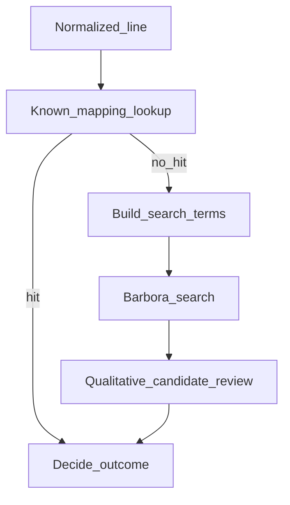

# Latvian product matching (MVP)

## Purpose and scope

This document describes a **practical, MVP-oriented** strategy for **product discovery and matching** when the user’s shopping intent is compared to **Barbora.lv** listings. Listings and search may be **Latvian**, **mixed Latvian and other languages**, or **inconsistent** with how people write shopping lists.

**Where this logic lives:** Matching, disambiguation, and confidence judgments belong in the **product resolver**, which passes **decided** instructions to the **browser / cart executor**. The executor performs deterministic steps and does not reinterpret product meaning. See [system design](system-design.md).

**What this document is not:** It does **not** define persistence formats, database schemas, or implementation details. It does **not** cover payment, checkout beyond the agreed handoff, or multi-retailer catalogs. It does **not** replace the [data model](data-model.md); it uses the same conceptual entities (**NormalizedItem**, **KnownBarboraProductMapping**, **SubstitutionPolicy**, per-line outcomes).

**Payment:** Unchanged from [product requirements](product-requirements.md): the agent **never** automates payment.

**Substitutions:** A full substitutions engine is **out of MVP product scope** per the PRD. This spec only describes how **substitution policy** steers outcomes when the preferred product is missing or unsuitable—without designing a generic substitution product.

---

## Why naive translation is not enough

Relying on “translate the list to Latvian (or English) and search” fails in predictable ways:

- **Same words, different products:** Everyday terms like *piens* or *maize* match many SKUs (brands, fat content, sizes). Translation does not pick **one** catalog row.
- **How people write vs how the shop labels:** Users often write short lines (*piens 2l*, *pilngraudu maize*). Barbora titles add brand, grade, and pack details (*Tere piens 2,5%, 2 l*). Exact string equality is the exception, not the rule.
- **Mixed language:** A user might write *chicken breast* or *Greek yogurt* while the site uses Latvian product titles (*vistas fileja*, *grieķu jogurts*). Machine translation alone does not maintain a stable link to a **specific** product over time.
- **Inconsistent or marketing-heavy listings:** Packaging changes, promotional wording, and minor title edits break brittle “one canonical translated phrase” approaches.

So matching must treat intent and listing text as **related signals**, not as a single phrase to translate and equality-match.

---

## Canonical intent vs Barbora listing text

- **Canonical intent (for matching)** is carried by the **normalized line**: primarily `searchText` on the **NormalizedItem**, plus quantity or unit hints when present. That text reflects **what the user meant to buy** after light cleanup—not a global grocery ontology. See [data model](data-model.md).
- **Listing text** is what Barbora shows (product title, and whatever structured hints the implementation can read later, such as size or brand on the page).

The resolver’s job is to decide whether a given listing **adequately fulfills** the line’s intent, whether to **stop for human review**, or whether a **substitute** is acceptable under policy—not to force intent and title to become identical strings.

---

## Aliases and common wording variants

**Aliases** are extra strings (Latvian or mixed) that should be treated as the **same shopping intent** for lookup or search. They complement **known product mappings** and the normalized `searchText`.

For MVP, stay at the level of **common variants** people actually use:

- **Abbreviations and informal quantity phrasing:** e.g. *2l* vs *2 litri*, *piens* with or without explicit size if the user habitually means one size.
- **Harmless spelling or spacing differences** that appear on lists vs on site (implementation may normalize trivial cases; no claim of full morphological coverage).
- **Mixed-language synonyms** the user or household repeats: e.g. list says *butter* while the remembered Barbora title is *sviests* or a branded Latvian line.

**Explicit non-goal for MVP:** A general **Latvian morphology engine** (full declension and lemma generation across arbitrary phrases). If inflected forms appear in practice, they can be handled **incrementally** via **aliases** and **confirmed mappings**, not by promising systematic grammatical analysis in v1.

---

## Known Barbora product mappings (first priority)

When the preference / memory layer provides a **KnownBarboraProductMapping** whose `matchKeys` or `aliases` fit the current line, the resolver should treat that mapping as **first priority**: prefer going straight to that **Barbora product** (by `barboraProductRef`) instead of running a broad open search, subject to **availability** and **suitability** checks on the site.

This is the strongest form of **deterministic-first** behavior: a curated or confirmed link from intent to one catalog identity.

---

## Layered matching flow (MVP)

The resolver should follow a **fixed order** of steps per line. Later steps run only when earlier steps do not yield an acceptable, policy-compliant decision.

1. **Known mapping:** If a mapping matches, target that product; verify it still appears suitable on the page when the executor checks (out of stock or wrong variant may force fallback).
2. **Search terms:** If no mapping, derive one or a few **search queries** from `searchText` and relevant **aliases** (including mixed-language variants you care to support). MVP does not require an exhaustive query generator—**practical coverage** over perfection.
3. **Barbora search:** Executor runs search; results feed the resolver as **candidates** (titles and any available attributes the implementation exposes).
4. **Qualitative candidate review:** Resolver compares candidates to intent using **plain-language criteria** (next section)—no numeric scoring model.
5. **Decision:** Emit an outcome such as **add this product**, **substitute** (if allowed and clearly appropriate), **skip**, or **`review_needed`**, consistent with [SubstitutionPolicy](#substitution-policy-and-outcomes) and confidence buckets below.

---

## Candidate evaluation (qualitative, practical)

For each candidate listing, the resolver asks **descriptive** questions, not computed scores:

- Does the title **obviously describe** the same kind of product as the line (e.g. *pilngraudu maize* vs a whole-grain bread listing, not a cake or snack)?
- Are **size or unit** hints **compatible** when the user specified them (*2 l* milk vs a 1 l pack)?
- Is there an **obvious mismatch** (wrong animal, wrong basic category, clearly different product type)?

If **one** candidate is clearly right and others are clearly weaker or off-topic, that is a **clear match**. If **several** listings look similarly plausible for a vague line, that is **ambiguity**. If **none** fit, that is **no fit**.

**Explicit MVP stance:** No **scoring formulas**, **weighted ranks**, or **pseudo-algorithms** in this spec. Implementation may use simple rules and string normalization internally; the **documented contract** stays qualitative.

---

## Confidence buckets (three, MVP)

Use **three conceptual buckets** only. They describe **resolver certainty**, not stock or price guarantees.

| Bucket | Meaning (conceptual) |
|--------|----------------------|
| **Clear** | A single listing (or a known mapped product still suitable on the page) **obviously** matches the intent; alternatives are clearly inferior or irrelevant. |
| **Uncertain** | Plausible options exist but **no single obvious** choice; wording overlaps; or suitability depends on details the user should see. |
| **No fit** | No candidate is acceptable, or the only options are **clearly wrong** for the line. |

These buckets drive **whether to auto-instruct an add** vs **stop for review**, together with substitution policy.

---

## Auto-add vs `review_needed`

- **Clear** bucket: The resolver may instruct the executor to **add** the chosen product (or an **allowed substitute** that is itself **clearly** appropriate under policy). The executor still verifies the step succeeded on the site.
- **Uncertain** bucket: Default to **`review_needed`** so the user can choose on Barbora unless product policy explicitly allows a **very conservative** auto-path later. MVP should **bias toward review** when in doubt.
- **No fit** bucket: **Do not add.** Outcome is **`skipped`** or **`review_needed`** depending on whether the user should be prompted to fix the line or pick a product manually.

If **SubstitutionPolicy.requireReviewOnSubstitute** is true, choosing a substitute—even when the substitute looks **clear**—should favor **`review_needed`** over silent substitution when ambiguity or user sensitivity warrants it (exact behavior can stay a single conservative rule in implementation).

Outcomes align with the per-line results described in [data model](data-model.md) (e.g. `added`, `substituted`, `skipped`, `review_needed`).

---

## Substitution policy and outcomes

**SubstitutionPolicy** (see [data model](data-model.md)) supplies **defaults and per-line overrides** for whether substitutes are allowed. Matching strategy uses it as follows:

- If the **preferred** product is **unavailable** or **unsuitable** and **substitutes are disallowed** for that line: do not pick another product; outcome **`skipped`** or **`review_needed`**.
- If **substitutes are allowed**: a **clear** alternative of the **same kind** (e.g. another *2 l* whole milk when the usual brand is out) may lead to **`substituted`** only when the resolver’s judgment is **clear**; otherwise **`review_needed`**.
- A **full** substitution engine (rich rules, category graphs, nutrition) is **not** part of MVP; **policy + qualitative fit** are enough to state intent.

---

## Incremental improvement through confirmed mappings

The system should get **more reliable over time** by growing **KnownBarboraProductMapping** entries (`matchKeys`, `aliases`, `barboraProductRef`, optional `lastConfirmedAt`). **Sources of truth** for “this mapping is correct” should be:

1. **Explicit user confirmation** (“this is my milk,” “remember this choice”) when the product offers that.
2. **Repeated successful use without correction**: the same line resolves to the same product across runs and the user does **not** change or reject it on Barbora or in feedback—treated as **soft** reinforcement, not infallible proof.

**Do not** treat **every successful add** as automatic ground truth: a run can succeed with a **wrong** item if the user does not catch it immediately. Prefer **explicit confirmation** for high-trust memory; use repetition only as a **secondary** signal with conservative rules.

When multiple mappings could apply, **recency** (`lastConfirmedAt`) can prefer fresher choices without specifying storage.

---

## Examples (illustrative)

- **Generic + size:** Intent *piens 2l* might match a listing *Tere piens 2,5%, 2 l* if that is the **clear** best candidate among results; several similar *2 l* milks with no strong reason to prefer one → **Uncertain** → **`review_needed`**.
- **Specific wording:** *pilngraudu maize* should align with whole-grain bread titles, not dessert *maize* products—if titles are ambiguous, bucket **Uncertain**.
- **Mixed language:** List *Greek yogurt 400g* vs site *grieķu jogurts* with comparable pack size—aliases or search terms might bridge; if many yogurts match, **Uncertain**.
- **Known mapping:** User confirmed *mana parastā piens* → specific `barboraProductRef`; next run hits mapping first, then verifies the product still looks right on the page.
- **Brand vs generic:** Intent *sviests* (or *butter* as an alias) often returns many branded packs; with no mapping and no obvious single winner, treat as **Uncertain** and **`review_needed`** unless one listing is **clearly** the household default.

---

## Related documents

- [Product requirements](product-requirements.md) — MVP scope; payment never automated.  
- [User flow](user-flow.md) — Input through checkout handoff and manual payment.  
- [System design](system-design.md) — Resolver vs executor; modules.  
- [Data model](data-model.md) — NormalizedItem, KnownBarboraProductMapping, SubstitutionPolicy, run outcomes.  
- Planned: [Run summary](run-summary.md) — structured reporting format (TASK-010).
