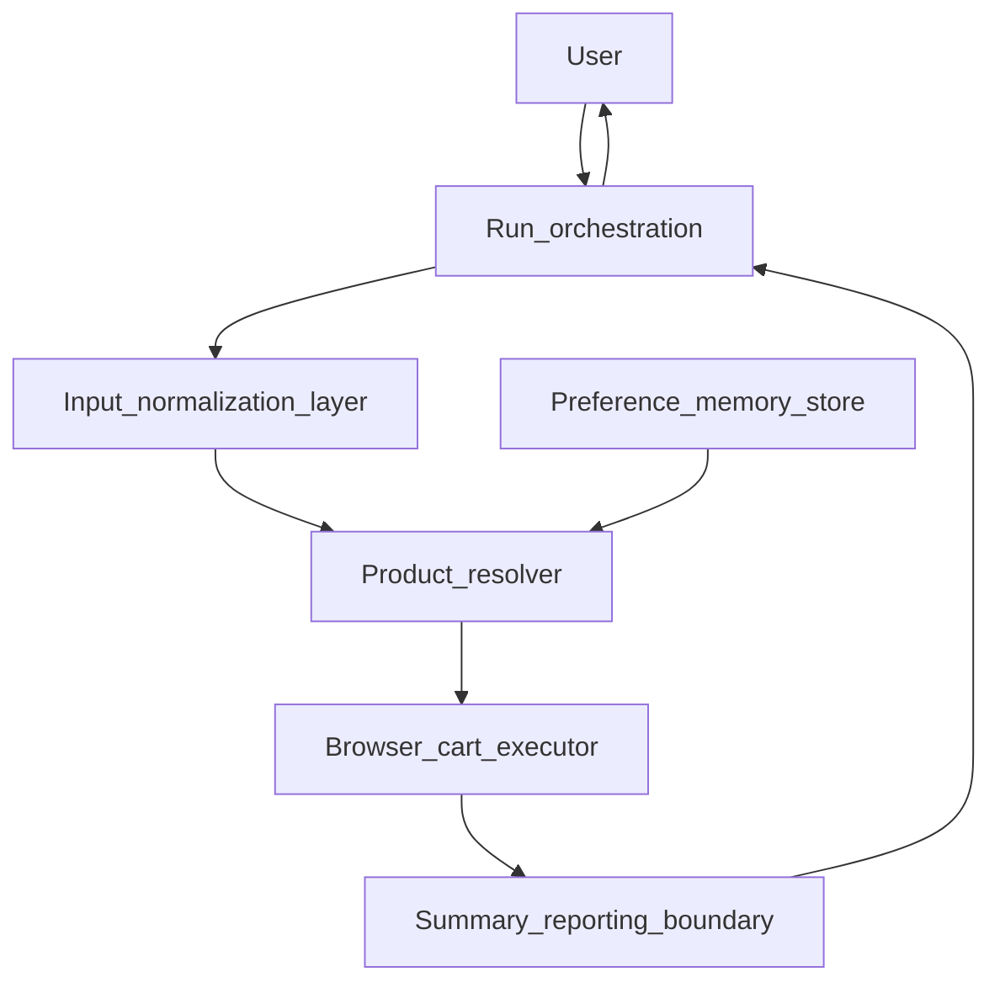

# System design (MVP)

## Purpose and scope

This document describes the **main modules and boundaries** for barbora-cart-agent at an architectural level. It is **not** an implementation guide: it avoids Playwright specifics, selectors, and persistence technology. It aligns with the [product requirements](product-requirements.md) and [user flow](user-flow.md). It does **not** define low-level data shapes (see the planned [data model](data-model.md) spec) or matching algorithms (see the planned [Latvian product matching](latvian-product-matching.md) spec).

**Safety:** The system must **never** automate or complete payment. Automation stops at **checkout handoff**; the user pays manually on Barbora.

## High-level view

The agent turns shopping intent into a prepared Barbora cart and brings the user to checkout. A **run orchestration** step drives one end-to-end pass: **normalizing input**, **resolving items** (including future reasoning about Latvian listings), **executing deterministic browser actions**, optional **remembered preferences**, and a **thin reporting boundary** for run outcomes.

**Flow:** Orchestration invokes the input layer, then the resolver. The resolver may consult memory, then passes concrete actions to the executor. The executor drives the browser up to checkout handoff. Outcomes surface through the summary boundary (minimal in early MVP) back to the user via orchestration.

## Modules

### Input normalization layer

**Responsibility:** Accept shopping intent (e.g. a list of items) and produce a **consistent internal representation** for one run: trim noise, drop empty lines, preserve user wording where it matters for search, and apply any agreed rules for quantities or units at the *documented* level—not “planning” in the sense of AI goal decomposition. There is **no** requirement for advanced automated planning here; this layer is **structuring and validating input**, not inventing a multi-step strategy.

**Inputs / outputs:** **In:** raw user shopping intent. **Out:** normalized line items (and validation issues) for a single run, consumed by the resolver.

**Out of scope for this layer:** Driving the browser, choosing Barbora products, or payment.

### Product resolver

**Responsibility:** Turn each normalized line item into **concrete decisions** Barbora can act on: what to search for, which candidate to prefer, whether to allow substitutes (when that exists), when to flag **needs human review**, and confidence where relevant. This is the **primary place for future reasoning**: interpreting **Latvian** product names and listings, ambiguity, and ranking—without pushing ad-hoc heuristics into the browser layer.

**Inputs / outputs:** **In:** normalized line items; optional hints from the preference store. **Out:** explicit instructions for the browser executor, plus resolver-side outcomes (e.g. skipped or review-needed) for reporting.

**Out of scope for this layer:** Raw DOM manipulation, session cookies, or checkout navigation. It **outputs** decisions and instructions; it does not click.

### Browser / cart executor

**Responsibility:** **Deterministic automation** against Barbora: session handling, search, add-to-cart, verifying cart state, and navigating to the **checkout handoff** point. It executes **explicit** instructions from the resolver (or from known mappings resolved via memory). Retries, waits, and selectors belong here.

**Inputs / outputs:** **In:** explicit instructions from the resolver. **Out:** observable execution results (e.g. success or failure per step, cart changed or not) for the summary boundary—not reinterpreted product semantics.

**Hard rules:** No payment steps, no order submission, no “complete purchase” automation. Stop at the agreed handoff boundary.

**Out of scope for this layer:** Semantic interpretation of Latvian product text or open-ended “pick the best match” logic—that stays in the resolver side of the boundary.

### Preference / memory store

**Responsibility:** Persist **user-confirmed or recurring** mappings (e.g. “this string means this Barbora product”) and light preferences so the resolver can **prefer known choices** before broad search. Initial MVP may be **empty or minimal**; the boundary is defined so a dedicated known-mapping implementation can attach without redrawing the architecture.

**Inputs / outputs:** **In:** confirmations or updates from successful runs or user action. **Out:** lookup hints to the resolver before broad search.

**Out of scope:** Defining storage format here (covered by implementation and data-model tasks).

### Summary / reporting boundary

**Responsibility:** A **conceptual** place where run results become visible: what was added, skipped, substituted (when that exists), or marked for review. It **aggregates** resolver outcomes and executor outcomes so the user (or logs) can see what happened. **Early MVP does not require a rich dashboard or detailed report format**—logging or a short console summary may suffice. A fuller, structured format is a separate concern (see planned [run summary](run-summary.md) spec, TASK-010 in the backlog).

**Inputs / outputs:** **In:** resolver-side results and executor-side results from the run. **Out:** user-visible or logged summary (format deferred).

**Out of scope for this boundary:** Defining fields or file formats; **not** implying that full reporting ships in the first iteration.

## Deterministic automation vs future reasoning

| Aspect | Deterministic (executor) | Reasoning / matching (resolver) |
|--------|---------------------------|----------------------------------|
| Role | Reliable steps: navigate, search, add, verify, hand off | Interpret intent vs Latvian listings, ambiguity, confidence |
| Change profile | Breaks when the site UI changes; should stay testable | Improves with better models, rules, and memory—not DOM details |
| Feeds the other | Consumes **decided** actions | Produces **decided** actions for the executor |

The **contract** between them is qualitative: the resolver supplies **unambiguous instructions** for the executor to carry out; the executor does not second-guess product meaning.

### Cross-module boundaries

**Resolver ↔ executor:** The resolver sends **decided** work: what to search, what to add, when to stop for human review. The executor performs steps and returns **observable outcomes** (success, failure, cart state signals)—not a new interpretation of which product was “meant.” Using scraped listing text to **choose** among products is resolver work; the executor may still read the page to **execute** clicks and **verify** state deterministically.

**Elsewhere:** Crossing between modules is **conceptual** in this document; concrete shapes belong in the [data model](data-model.md) spec (TASK-003).

## MVP alignment and out of scope

- **Aligned with MVP:** Input → resolve → cart → user reviews on Barbora → checkout handoff → manual payment; [user flow](user-flow.md).
- **Latvian** context is a resolver-side and matching concern; **Barbora-only** for MVP—**multi-store** or other retailers is **out of scope** (may be revisited later without designing for it now).
- **Substitutions** as a full engine is **out of MVP product scope** per PRD; where they appear later, policy and decisions live in the **resolver** and surface in **summary/reporting**, not in the executor’s core click logic.

## Related documents

- [Product requirements](product-requirements.md) — MVP scope and constraints.
- [User flow](user-flow.md) — End-to-end steps.
- Planned: [data model](data-model.md), [Latvian product matching](latvian-product-matching.md), [run summary](run-summary.md).
