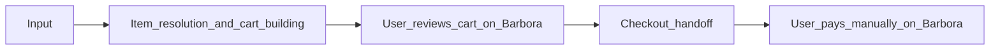

# User flow (MVP)

MVP flow is **simple and linear**. There is **one** natural review point: the user reviews the **cart on Barbora** before checkout handoff. No extra confirmation checkpoints are required for MVP unless you later add them for implementation reasons.

## Steps

1. **Input**  
   User provides what they want to buy (e.g. shopping list). Format is not fixed in this document.

2. **Item resolution and cart building**  
   The agent resolves items against Barbora and adds them to the Barbora cart. Barbora product names, search, and listings may be **Latvian**; the user sees Barbora’s own pages.

3. **User reviews cart on Barbora**  
   User inspects line items, quantities, and prices in **Barbora’s cart UI** and adjusts if needed (manual edits on site are fine).

4. **Checkout handoff**  
   User is taken to the point where they can **proceed to Barbora checkout** with the prepared cart (exact mechanism is an implementation detail).

5. **User pays manually**  
   User completes payment **only** through Barbora’s normal checkout. **The agent never completes or automates payment.**

## Out of scope for this flow document

- Formal **run summary** or **output format** after a run (specified elsewhere, later).
- **Matching** or **search algorithms** for Latvian vs other text.
